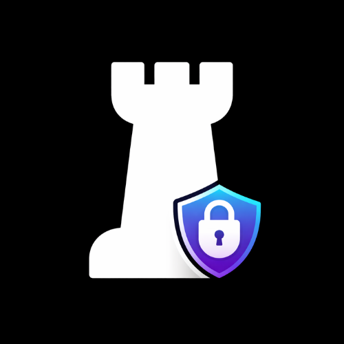
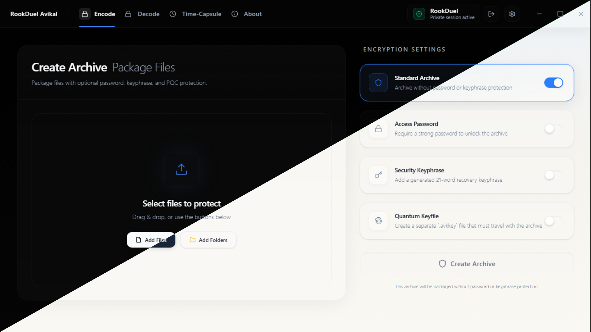
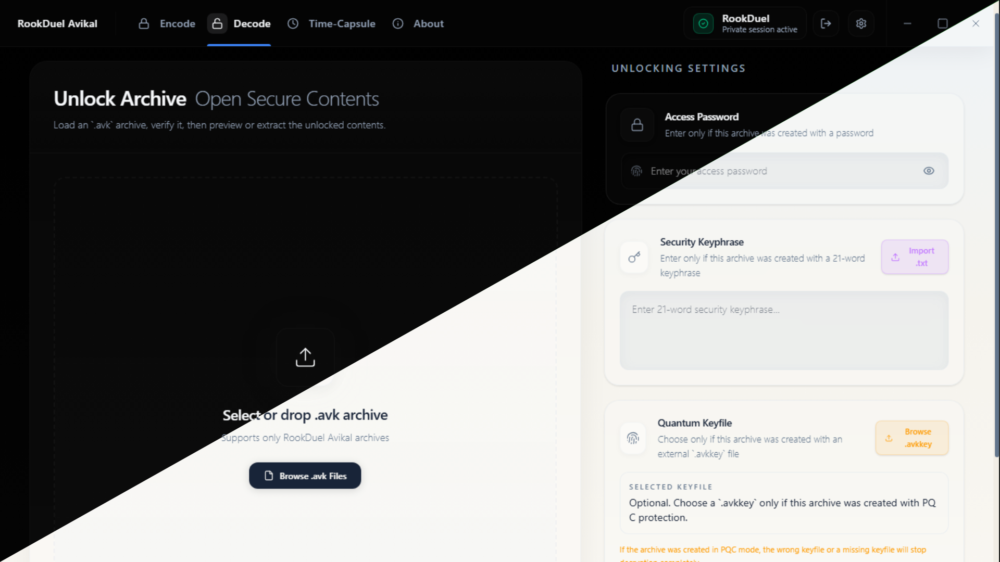
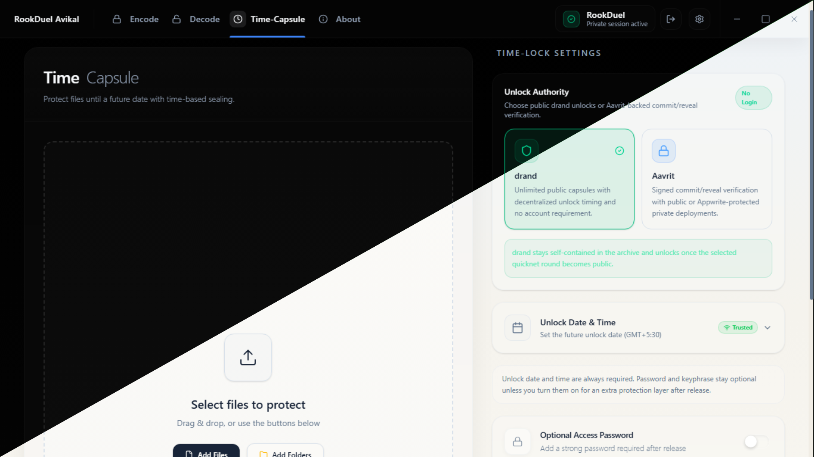

<a id="readme-top"></a>

<!-- ── REPOSITORY BADGES ──────────────────────────────────────────────────── -->

[![Contributors][contributors-shield]][contributors-url]
[![Forks][forks-shield]][forks-url]
[![Stargazers][stars-shield]][stars-url]
[![Issues][issues-shield]][issues-url]
[![License][license-shield]][license-url]
[![Release][release-shield]][release-url]

<!-- ── HEADER ─────────────────────────────────────────────────────────────── -->

<br/>
<div align="center">

<a href="https://github.com/RookDuel/Avikal">
  
</a>

<h1 align="center">RookDuel Avikal</h1>

<p align="center">
  Lock your files. Set them free — only when the time is right.
  <br/>
  <em>Secure archives with Chess-encoded keys, Hindi keyphrases, and time-locked encryption.</em>
  <br/><br/>
  <a href="https://avikal.rookduel.tech"><strong>avikal.rookduel.tech »</strong></a>
  <br/><br/>
  <a href="https://avikal.rookduel.tech">Download for Windows</a>
  &middot;
  <a href="https://github.com/RookDuel/Avikal/issues/new?labels=bug">Report a Bug</a>
  &middot;
  <a href="https://github.com/RookDuel/Avikal/issues/new?labels=enhancement">Request a Feature</a>
</p>

</div>

---

<!-- ── TABLE OF CONTENTS ──────────────────────────────────────────────────── -->

<details>
  <summary>Table of Contents</summary>
  <ol>
    <li><a href="#what-is-rookduel-avikal">What is RookDuel Avikal?</a></li>
    <li><a href="#what-makes-it-special">What Makes It Special</a></li>
    <li><a href="#how-your-files-are-protected">How Your Files Are Protected</a></li>
    <li><a href="#timecapsule--unlock-in-the-future">TimeCapsule — Unlock in the Future</a></li>
    <li><a href="#built-with">Built With</a></li>
    <li>
      <a href="#get-started">Get Started</a>
      <ul>
        <li><a href="#for-regular-users--desktop-app">Regular Users — Desktop App</a></li>
        <li><a href="#for-developers--cli">Developers — CLI</a></li>
        <li><a href="#run-from-source">Run From Source</a></li>
        <li><a href="#contributor-setup">Contributor Setup</a></li>
      </ul>
    </li>
    <li><a href="#cli-commands">CLI Commands</a></li>
    <li><a href="#app-walkthrough">App Walkthrough</a></li>
    <li><a href="#repository-layout">Repository Layout</a></li>
    <li><a href="#security-notice">Security Notice</a></li>
    <li><a href="#contributing">Contributing</a></li>
    <li><a href="#documentation">Documentation</a></li>
    <li><a href="#contact--community">Contact & Community</a></li>
    <li><a href="#license">License</a></li>
  </ol>
</details>

---

## What is RookDuel Avikal?

**RookDuel Avikal** lets you pack any files into a secure `.avk` archive — protected by a password, a 21-word Hindi keyphrase, or both. You can also set a **time lock**, so the archive cannot be opened until a specific date and time you choose.

It comes in two forms:

- **Desktop App** — a visual app for Windows. No technical knowledge needed.
- **Python CLI** — a terminal command (`avikal`) for developers who prefer scripting or automation.

Both use the same encryption engine underneath, so your files are equally protected regardless of which you use.

---

## What Makes It Special

### Chess-Encoded Key Storage

Most archive tools store their encryption keys in a simple data file. RookDuel Avikal does something entirely different — it encodes the key information as a **real, playable chess game** stored in PGN format (the standard notation used by chess software).

The archive's keychain file (`keychain.pgn`) looks like an ordinary chess game — and it is. The actual key material and metadata are hidden inside the sequence of legal chess moves using a custom chess engine built into the project. This is not just a cosmetic choice. It means the keychain looks like something ordinary and is structurally valid chess, making it harder to identify and tamper with.

### Devanagari (Hindi) Keyphrase

Instead of the standard English word lists used by tools like Bitcoin wallets, RookDuel Avikal uses a **2,048-word Hindi wordlist written in Devanagari script**. When you protect an archive with a keyphrase, the system generates 21 random Hindi words — giving you **224 bits of entropy**, which is stronger than most password-based systems.

Each keyphrase is checksum-validated, so a single wrong or mistyped word is detected immediately. The phrase is then converted to an encryption key using Argon2id — a memory-hard algorithm that makes brute-force guessing computationally expensive.

### TimeCapsule

You can lock any archive to a future date. Until that date arrives, the archive physically cannot be decrypted — not even by you. Two independent time systems enforce this:

- **drand** — a global public randomness network run by universities and research institutions
- **Aavrit** — an upcoming RookDuel project that acts as a signed time authority

These are explained in detail in the [TimeCapsule section](#timecapsule--unlock-in-the-future).

---

## How Your Files Are Protected

When you create an archive, here is what happens behind the scenes — explained simply:

### 1. Your password is hardened — not stored directly

Your password is never stored. Instead, it is put through **Argon2id** — a password hardening algorithm that deliberately uses 256 MB of memory and takes several seconds to compute. This means even if someone gets the archive file, guessing your password requires enormous computing power per attempt. A GPU farm that can guess billions of simple passwords per second is slowed to a crawl.

Libraries used: [`cryptography`](https://cryptography.io/) (Python Cryptographic Authority), `pqcrypto`

### 2. Files are encrypted with AES-256-GCM

The actual files inside the archive are encrypted using **AES-256-GCM** — the same standard used by governments, banks, and messaging apps like Signal and WhatsApp. The "GCM" part adds authentication: if anyone tampers with even a single byte of the archive, decryption fails and you are warned immediately.

A random 12-byte nonce is generated fresh for every encryption, so two identical files always produce different ciphertext.

### 3. The keychain is hidden inside a chess game

The encryption keys and metadata (file names, timestamps, protection mode) are encoded into a real chess PGN file. The chess game is then also encrypted using AES-256-GCM with its own separate key derived from your password. So even the key file is double-protected.

### 4. Random padding hides your file size

After compression (using Brotli), random padding between 1 KB and 10 KB is added before encryption. This means an attacker cannot guess what kind of file is inside based on the archive size.

### 5. Optional: Quantum-Resistant Protection (PQC)

If you enable the PQC option, RookDuel Avikal generates an additional keypair using **ML-KEM-1024** (also known as Kyber-1024) — the algorithm selected by NIST as the standard for post-quantum encryption.

Here is the simple version of what this means: today's encryption is safe against regular computers. But future quantum computers could theoretically break it. ML-KEM-1024 is designed to remain secure even against those future machines.

When PQC is enabled, a separate `.avkkey` file is created alongside your archive. This file holds the quantum-resistant private key, encrypted with your password. **You must keep this `.avkkey` file safe.** Without it, a PQC-protected archive cannot be opened — even if you have the correct password.

### 6. Keys are wiped from memory after use

After encryption or decryption, RookDuel Avikal attempts to overwrite key material in memory before the process ends, reducing the window in which a memory dump could expose your keys.

### Password Rules

RookDuel Avikal enforces strong passwords. It checks for:
- Minimum 12 characters
- Mix of uppercase, lowercase, digits, and symbols
- Not a known common password (checked against a blocklist)
- No keyboard patterns (`qwerty`, `123456`, etc.)
- No repeated or sequential characters

The UI shows live entropy feedback so you know exactly how strong your password is.

---

## TimeCapsule — Unlock in the Future

The TimeCapsule feature lets you create an archive that **cannot be opened until a specific date and time**. The lock is not enforced by a simple date check — it relies on external networks that cannot be manipulated.

### How drand works

**drand** (Distributed Randomness) is a public network run by universities, research institutes, and infrastructure providers around the world (including EPFL, Protocol Labs, and Cloudflare). Every few seconds, these organizations collectively produce a new random value — and crucially, **future values cannot be predicted or faked**.

When you create a drand TimeCapsule, your archive is encrypted using a key that does not exist yet — it can only be reconstructed once the drand network reaches the specific round corresponding to your chosen unlock time. Until that round is reached, the key literally does not exist anywhere in the world. No one can open the archive early.

This is called **tlock encryption** — time-based locking using threshold cryptography.

### How Aavrit works

**Aavrit** is an upcoming RookDuel project. It acts as a **signed time authority**: when you create an Aavrit TimeCapsule, the Aavrit server records a cryptographic commitment (a signed promise) that it will only reveal the unlock key after the specified date — verified using **Ed25519 signatures**.

Unlike drand, Aavrit is centrally operated by RookDuel, which means it carries a different trust model. The advantage is flexibility — Aavrit can support private or permissioned time-lock scenarios that a fully public network cannot.

### Time verification

RookDuel Avikal never trusts your computer's clock for TimeCapsule validation. It fetches the current time from **Google's NTP server** (`time.google.com`) over UDP, with an HTTPS Date-header fallback. Your system clock cannot be manipulated to bypass a time lock.

---

## Built With

**Tech Stack**

[![Electron][electron-shield]][electron-url]
[![React][react-shield]][react-url]
[![FastAPI][fastapi-shield]][fastapi-url]
[![Python][python-lang-shield]][python-url]
[![TypeScript][typescript-shield]][typescript-url]

**Security**

[![AES-256-GCM][aes-shield]](#how-your-files-are-protected)
[![Argon2id][argon2-shield]](#how-your-files-are-protected)
[![ML-KEM-1024 PQC][pqc-shield]](#how-your-files-are-protected)
[![TimeCapsule][timecapsule-shield]](#timecapsule--unlock-in-the-future)
[![drand][drand-shield]](#timecapsule--unlock-in-the-future)

**Archive Format**

[![AVK Format][avk-shield]](#repository-layout)
[![Hindi Keyphrase][hindi-shield]](#devanagari-hindi-keyphrase)
[![Chess PGN Keys][chess-shield]](#chess-encoded-key-storage)

<p align="right">(<a href="#readme-top">back to top</a>)</p>

---

## Get Started

### For Regular Users — Desktop App

The RookDuel Avikal desktop app is a Windows `.exe` installer. No Python, no terminal, no setup.

[![Download for Windows][download-win-shield]][release-url]

**Where to download:**
- **[avikal.rookduel.tech](https://avikal.rookduel.tech)** — the official product page, always has the latest version
- **[GitHub Releases](https://github.com/RookDuel/Avikal/releases/latest)** — all versioned releases with changelogs

> **Platform:** Windows only. macOS and Linux desktop builds are not currently available.

<p align="right">(<a href="#readme-top">back to top</a>)</p>

---

### For Developers — CLI

The `avikal` command works on any platform with Python 3.11 or newer.

[![PyPI][pypi-shield]][pypi-url]
[![Python Versions][python-shield]][pypi-url]
[![PyPI Downloads][downloads-shield]][pypi-url]

```sh
pip install avikal
avikal --help
```

Module entry points also work:

```sh
python -m avikal_backend --help
python -m avikal_backend.cli --help
```

> The pip package ships the CLI and shared archive core only. The desktop app's API layer is not included in the PyPI package.

To install from the local backend source:

```powershell
pip install .\backend
avikal --help
```

<p align="right">(<a href="#readme-top">back to top</a>)</p>

---

### Run From Source

To run the full desktop app from source (requires Node.js and Python 3.11+):

```powershell
npm install
cd frontend
npm install
cd ..
cd backend
python -m venv venv
venv\Scripts\activate
pip install -r requirements.txt
cd ..
npm run dev
```

<p align="right">(<a href="#readme-top">back to top</a>)</p>

---

### Contributor Setup

For development with a live editable backend:

```powershell
npm install
cd frontend
npm install
cd ..
cd backend
python -m venv venv
venv\Scripts\activate
pip install -r requirements.txt
pip install -e .
cd ..
```

Run the desktop app:

```powershell
npm run dev
```

Run the CLI:

```powershell
avikal --help
```

See [CONTRIBUTING.md](./CONTRIBUTING.md) for branch conventions and review expectations.

<p align="right">(<a href="#readme-top">back to top</a>)</p>

---

## CLI Commands

| What you want to do | Command |
|:---|:---|
| Encrypt a file with a password | `avikal enc document.pdf -p "StrongPass#123"` |
| Encrypt with a Hindi keyphrase | `avikal enc document.pdf --keyphrase "word1 word2 ... word21"` |
| Add quantum-resistant protection | `avikal enc document.pdf -p "StrongPass#123" --pqc` |
| Create a time-locked archive | `avikal enc reports --timecapsule -u "2026-05-01 12:00" -p "StrongPass#123"` |
| See what's inside an archive | `avikal info locked.avk` |
| List files in an archive | `avikal ls locked.avk -p "StrongPass#123"` |
| Decrypt an archive | `avikal dec locked.avk -d output -p "StrongPass#123"` |

Full reference with all flags and examples: [CLI_USAGE.md](./CLI_USAGE.md)

<p align="right">(<a href="#readme-top">back to top</a>)</p>

---

## App Walkthrough

### Encode — Pack and protect your files

Select files, choose a protection method (password, keyphrase, or both), and optionally enable TimeCapsule or PQC. The app guides you through every step.

<div align="center">
  
</div>

<br/>

### Decode — Open your archive safely

Drag in the `.avk` file, provide your credentials, and the app opens your files in a secure temporary preview session — nothing is written to your disk until you choose to extract.

<div align="center">
  
</div>

<br/>

### TimeCapsule — Schedule a future unlock

Pick a future date and time, choose between drand (public) or Aavrit (RookDuel-operated), and create an archive that the world cannot open until the moment arrives.

<div align="center">
  
</div>

<p align="right">(<a href="#readme-top">back to top</a>)</p>

---

## Repository Layout

```
RookDuel Avikal/
├── electron/                  # Desktop shell and native bridge
├── frontend/                  # React UI (Vite)
├── backend/
│   ├── api_server.py          # Desktop app backend launcher
│   ├── pyproject.toml         # Python package (CLI + PyPI)
│   └── src/avikal_backend/
│       ├── api/               # FastAPI routes (desktop only)
│       │   ├── drand.py       # drand tlock integration
│       │   └── aavrit_client.py  # Aavrit HTTP client
│       ├── archive/
│       │   ├── security/
│       │   │   ├── crypto.py       # AES-256-GCM, Argon2id, PQC
│       │   │   ├── pqc_keyfile.py  # ML-KEM-1024 keyfile management
│       │   │   └── time_lock.py    # NTP-verified time validation
│       │   └── chess_metadata.py   # Chess PGN key encoding
│       ├── chess/             # Custom chess board and PGN engine
│       ├── cli/               # Standalone CLI
│       ├── mnemonic/          # Hindi keyphrase generation (2048 words)
│       └── services/          # NTP time service
└── scripts/                   # Build and packaging scripts
```

<p align="right">(<a href="#readme-top">back to top</a>)</p>

---

## Security Notice

> [!WARNING]
> If you lose your password, keyphrase, or `.avkkey` file, your archive **cannot be recovered**. RookDuel Avikal has no backdoor and no recovery mechanism. Keep your credentials safe.

- PQC-protected archives require the `.avkkey` file at unlock time — losing it makes the archive permanently inaccessible.
- Aavrit TimeCapsule archives depend on the Aavrit service remaining available and trusted.
- The desktop app decrypts files into a temporary folder for preview. Nothing is saved to your chosen location until you explicitly extract.
- Time locks are verified using Google NTP — your computer's system clock is never trusted.

Full trust model and responsible disclosure: [SECURITY.md](./SECURITY.md)

<p align="right">(<a href="#readme-top">back to top</a>)</p>

---

## Contributing

Contributions are what make open source great. Any contribution to RookDuel Avikal is appreciated.

1. Fork the repository
2. Create your feature branch — `git checkout -b feature/your-feature`
3. Commit your changes — `git commit -m "feat: describe your change"`
4. Push to the branch — `git push origin feature/your-feature`
5. Open a Pull Request

### Contributors

<a href="https://github.com/RookDuel/Avikal/graphs/contributors">
  
</a>

Full contributor workflow: [CONTRIBUTING.md](./CONTRIBUTING.md)

<p align="right">(<a href="#readme-top">back to top</a>)</p>

---

## Documentation

| Document | What it covers |
|:---|:---|
| [ARCHITECTURE.md](./ARCHITECTURE.md) | How the system is structured, runtime flows, and Aavrit integration |
| [CLI_USAGE.md](./CLI_USAGE.md) | All CLI commands, flags, and real-world examples |
| [SECURITY.md](./SECURITY.md) | Trust model, security boundaries, and responsible disclosure |
| [CONTRIBUTING.md](./CONTRIBUTING.md) | How to contribute and what the review process looks like |
| [CODE_OF_CONDUCT.md](./CODE_OF_CONDUCT.md) | Community standards |

<p align="right">(<a href="#readme-top">back to top</a>)</p>

---

## Contact & Community

**RookDuel** — the team behind Avikal.

[![Website][website-shield]][website-url]
[![Avikal][avikal-site-shield]][avikal-site-url]
[![Email][email-shield]][email-url]


<p align="right">(<a href="#readme-top">back to top</a>)</p>

---

## License

Distributed under the Apache License 2.0. See [`LICENSE`](./LICENSE) for details.

[![License][license-shield]][license-url]
[![Release][release-shield]][release-url]

<div align="center">
  <br/>
  <sub>Built by <a href="https://rookduel.tech">RookDuel</a> &nbsp;·&nbsp; Apache 2.0 &nbsp;·&nbsp; Open for contributions</sub>
</div>

<p align="right">(<a href="#readme-top">back to top</a>)</p>

---

<!-- ── REFERENCE LINKS ─────────────────────────────────────────────────────── -->

<!-- Repository -->
[contributors-shield]: https://img.shields.io/github/contributors/RookDuel/Avikal.svg?style=for-the-badge&labelColor=0d1117
[contributors-url]: https://github.com/RookDuel/Avikal/graphs/contributors
[forks-shield]: https://img.shields.io/github/forks/RookDuel/Avikal.svg?style=for-the-badge&labelColor=0d1117
[forks-url]: https://github.com/RookDuel/Avikal/network/members
[stars-shield]: https://img.shields.io/github/stars/RookDuel/Avikal.svg?style=for-the-badge&color=1f6feb&labelColor=0d1117
[stars-url]: https://github.com/RookDuel/Avikal/stargazers
[issues-shield]: https://img.shields.io/github/issues/RookDuel/Avikal.svg?style=for-the-badge&color=dc2626&labelColor=0d1117
[issues-url]: https://github.com/RookDuel/Avikal/issues
[license-shield]: https://img.shields.io/github/license/RookDuel/Avikal.svg?style=for-the-badge&color=238636&labelColor=0d1117
[license-url]: https://github.com/RookDuel/Avikal/blob/main/LICENSE
[release-shield]: https://img.shields.io/github/v/release/RookDuel/Avikal?style=for-the-badge&logo=github&color=6d28d9&labelColor=0d1117
[release-url]: https://github.com/RookDuel/Avikal/releases/latest

<!-- PyPI / Package -->
[pypi-shield]: https://img.shields.io/pypi/v/avikal?style=for-the-badge&logo=pypi&logoColor=white&color=1f6feb&labelColor=0d1117
[pypi-url]: https://pypi.org/project/avikal/
[python-shield]: https://img.shields.io/pypi/pyversions/avikal?style=for-the-badge&logo=python&logoColor=white&color=3776AB&labelColor=0d1117
[downloads-shield]: https://img.shields.io/pypi/dm/avikal?style=for-the-badge&logo=pypi&logoColor=white&color=6d28d9&labelColor=0d1117

<!-- Download -->
[download-win-shield]: https://img.shields.io/badge/Download-Windows%20Installer-0078D4?style=for-the-badge&logo=windows&logoColor=white&labelColor=0d1117

<!-- Tech Stack -->
[electron-shield]: https://img.shields.io/badge/Desktop-Electron-9FEAF9?style=for-the-badge&logo=electron&logoColor=9FEAF9&labelColor=0d1117
[electron-url]: https://www.electronjs.org/
[react-shield]: https://img.shields.io/badge/Frontend-React-61dafb?style=for-the-badge&logo=react&logoColor=61dafb&labelColor=0d1117
[react-url]: https://react.dev/
[fastapi-shield]: https://img.shields.io/badge/Backend-FastAPI-009688?style=for-the-badge&logo=fastapi&logoColor=009688&labelColor=0d1117
[fastapi-url]: https://fastapi.tiangolo.com/
[python-lang-shield]: https://img.shields.io/badge/CLI-Python-3776AB?style=for-the-badge&logo=python&logoColor=3776AB&labelColor=0d1117
[python-url]: https://www.python.org/
[typescript-shield]: https://img.shields.io/badge/TypeScript-3178C6?style=for-the-badge&logo=typescript&logoColor=white&labelColor=0d1117
[typescript-url]: https://www.typescriptlang.org/

<!-- Security -->
[aes-shield]: https://img.shields.io/badge/AES--256--GCM-Authenticated%20Encryption-9a3412?style=for-the-badge&labelColor=0d1117
[argon2-shield]: https://img.shields.io/badge/Argon2id-Memory--Hard%20KDF-7c3aed?style=for-the-badge&labelColor=0d1117
[pqc-shield]: https://img.shields.io/badge/ML--KEM--1024-Post--Quantum-4f46e5?style=for-the-badge&labelColor=0d1117
[timecapsule-shield]: https://img.shields.io/badge/TimeCapsule-Time--Locked%20Archives-bd561d?style=for-the-badge&labelColor=0d1117
[drand-shield]: https://img.shields.io/badge/drand-Distributed%20Randomness-0ea5e9?style=for-the-badge&labelColor=0d1117
[avk-shield]: https://img.shields.io/badge/Format-.avk%20Archive-334155?style=for-the-badge&labelColor=0d1117
[hindi-shield]: https://img.shields.io/badge/Keyphrase-21%20Hindi%20Words%20%E0%A4%A6%E0%A5%87%E0%A4%B5%E0%A4%A8%E0%A4%BE%E0%A4%97%E0%A4%B0%E0%A5%80-ea580c?style=for-the-badge&labelColor=0d1117
[chess-shield]: https://img.shields.io/badge/Keys-Chess%20PGN%20Encoded-16a34a?style=for-the-badge&labelColor=0d1117

<!-- Contact / Social -->
[website-shield]: https://img.shields.io/badge/Website-rookduel.tech-1f6feb?style=for-the-badge&logo=googlechrome&logoColor=white&labelColor=0d1117
[website-url]: https://rookduel.tech
[avikal-site-shield]: https://img.shields.io/badge/Avikal-avikal.rookduel.tech-6d28d9?style=for-the-badge&logo=googlechrome&logoColor=white&labelColor=0d1117
[avikal-site-url]: https://avikal.rookduel.tech
[email-shield]: https://img.shields.io/badge/Email-contact@rookduel.tech-238636?style=for-the-badge&logo=gmail&logoColor=white&labelColor=0d1117
[email-url]: mailto:contact@rookduel.tech